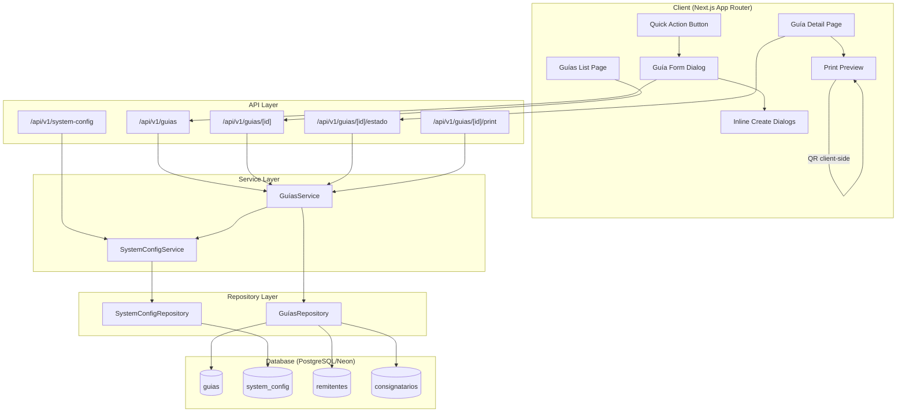
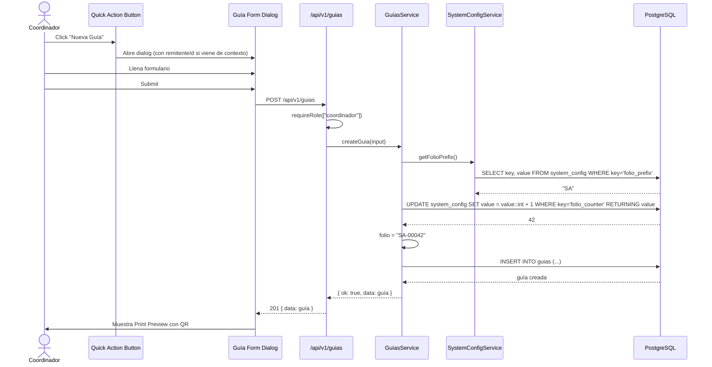

# Design Document: Sistema de Guías

## Overview

El Sistema de Guías reemplaza el módulo existente de "Órdenes" para alinearlo con el flujo real de negocio de SALTER: generación de guías de mensajería y paquetería. La transformación abarca renombrar la entidad en base de datos, rutas API, rutas de UI y navegación; rediseñar el formulario de creación con selección inline de remitente/consignatario, folio auto-generado con prefijo configurable, código QR, y vista previa de impresión en formato SALTER.

El diseño reutiliza la infraestructura existente (Drizzle ORM, repositorios, servicios, Auth.js, shadcn/ui) y se enfoca en:

1. Migración de la tabla `ordenes` → `guias` con nuevo esquema simplificado.
2. Nueva tabla `system_config` para prefijo de folio y copias por defecto.
3. API REST `/api/v1/guias` con restricción de rol `coordinador` para creación.
4. Generación atómica de folio secuencial `{PREFIJO}-{00001}`.
5. Botón flotante (FAB) visible solo para coordinadores en todo el dashboard.
6. Formulario de guía con creación inline de remitente/consignatario via diálogos.
7. Vista previa de impresión con QR y layout SALTER "Mensajería y Paquetería".

### Decisiones Clave

- Se usa una migración SQL para renombrar la tabla y columnas, no se crea una tabla nueva desde cero, para preservar datos existentes.
- El folio usa un campo `folio_counter` en `system_config` con `UPDATE ... RETURNING` para garantizar atomicidad sin race conditions.
- QR se genera client-side con la librería `qrcode` (ligera, sin dependencias server).
- La impresión usa `@media print` CSS con un componente React dedicado, sin dependencias de PDF.

## Architecture



### Flujo de Creación de Guía



## Components and Interfaces

### API Routes

#### `POST /api/v1/guias`
- Auth: `requireRole(["coordinador"])`
- Body: `CreateGuiaInput` (remitenteId, consignatarioId, pesoKg, piezas, tipoContenido, etc.)
- Response: `201 { data: Guia }` con folio auto-generado
- Errors: `403` (no autorizado), `422` (validación), `500` (server error)

#### `GET /api/v1/guias`
- Auth: `requireSession`
- Query params: `?page=1&limit=20&estado=creada`
- Response: `200 { data: Guia[] }`

#### `GET /api/v1/guias/[id]`
- Auth: `requireSession`
- Response: `200 { data: GuiaWithRelations }` (incluye remitente y consignatario expandidos)

#### `PATCH /api/v1/guias/[id]/estado`
- Auth: `requireRole(["coordinador"])`
- Body: `{ estado: "en_ruta" | "completada" | "cancelada" }`
- Response: `200 { data: Guia }`

#### `GET /api/v1/system-config`
- Auth: `requireRole(["administrador"])`
- Response: `200 { data: { folio_prefix: string, default_copies: number } }`

#### `PATCH /api/v1/system-config`
- Auth: `requireRole(["administrador"])`
- Body: `{ folio_prefix?: string, default_copies?: number }`
- Response: `200 { data: SystemConfig }`

### Service Layer

```typescript
// src/lib/services/guias.ts
interface GuiasService {
  createGuia(input: CreateGuiaInput): Promise<ServiceResult<Guia>>;
  getGuiaById(id: string): Promise<ServiceResult<GuiaWithRelations>>;
  listGuias(filters?: GuiaFilters): Promise<ServiceResult<Guia[]>>;
  cambiarEstadoGuia(id: string, estado: string, changedBy: string): Promise<ServiceResult<Guia>>;
}

// src/lib/services/systemConfig.ts
interface SystemConfigService {
  getConfig(): Promise<ServiceResult<SystemConfig>>;
  updateConfig(input: UpdateConfigInput): Promise<ServiceResult<SystemConfig>>;
  getNextFolio(): Promise<ServiceResult<string>>; // Atomic increment + format
}
```

### Repository Layer

```typescript
// src/lib/repositories/guias.ts
interface GuiasRepository {
  createGuia(data: GuiaInsert): Promise<Guia>;
  getGuiaById(id: string): Promise<GuiaWithRelations | null>;
  listGuias(filters?: GuiaFilters): Promise<Guia[]>;
  updateGuiaEstado(id: string, estado: string): Promise<Guia | null>;
}

// src/lib/repositories/systemConfig.ts
interface SystemConfigRepository {
  getConfigValue(key: string): Promise<string | null>;
  setConfigValue(key: string, value: string): Promise<void>;
  incrementAndGetCounter(key: string): Promise<number>; // Atomic via UPDATE RETURNING
}
```

### UI Components


#### `QuickActionButton` (src/components/quick-action-button.tsx)
- Botón flotante fijo `position: fixed; bottom: 1.5rem; right: 1.5rem`
- Solo visible si `session.user.role === "coordinador"`
- Icono `+` con tooltip "Nueva Guía"
- Al hacer click abre `GuiaFormDialog`
- Acepta prop opcional `defaultRemitenteId` para pre-llenado

#### `GuiaFormDialog` (src/components/guia-form-dialog.tsx)
- Dialog modal (shadcn/ui `Dialog`) con formulario de creación de guía
- Campos: remitente (SearchableSelect), consignatario (SearchableSelect), pesoKg, piezas, tipoContenido, numeroCuenta, comentarios
- Folio se muestra como badge read-only (se genera al guardar)
- Botones "Guardar" y "Guardar e Imprimir"
- Props: `open`, `onOpenChange`, `defaultRemitenteId?`

#### `InlineCreateDialog` (src/components/inline-create-dialog.tsx)
- Sub-dialog reutilizable para crear remitente o consignatario inline
- Se abre desde el SearchableSelect cuando no hay resultados
- Campos: nombre, rfc, calle, numExt, numInt, colonia, municipio, estado, cp, telefono, email
- Al guardar exitosamente, cierra el sub-dialog y auto-selecciona el nuevo registro

#### `GuiaPrintPreview` (src/components/guia-print-preview.tsx)
- Componente de vista previa de impresión
- Layout SALTER "Mensajería y Paquetería" con campos posicionados
- Genera QR code client-side con `qrcode` library
- Selector de número de copias (pre-llenado con `default_copies` de system_config)
- Botón "Imprimir" que invoca `window.print()` con CSS `@media print`

#### `GuiaPrintLayout` (src/components/guia-print-layout.tsx)
- Componente puro de layout para impresión (sin interactividad)
- Estructura del documento SALTER:

```
┌─────────────────────────────────────────────────┐
│  [LOGO SALTER]   Mensajería y Paquetería        │
│                                                   │
│  Origen: ________    No. De Cuenta: ________     │
│  Peso: ____ kg       Piezas: ____                │
│  Folio: SA-00042                    [QR CODE]    │
│                                                   │
│  ─── REMITENTE ───────────────────────────────── │
│  Nombre: _______________                          │
│  Dirección: _______________                       │
│  Colonia: _______________                         │
│  Ciudad y Estado: _______________                 │
│  Teléfono: _______________                        │
│                                                   │
│  ─── CONSIGNATARIO ──────────────────────────── │
│  Nombre: _______________                          │
│  Dirección: _______________                       │
│  Colonia: _______________                         │
│  Ciudad y Estado: _______________                 │
│  C.P.: _______________                            │
│  Teléfono: _______________                        │
│                                                   │
│  Fecha: ___/___/___                               │
│  Recolectado por: _______________                 │
│  Recibido: _______________                        │
└─────────────────────────────────────────────────┘
```

### Sidebar Update

El sidebar (`src/components/sidebar.tsx`) se actualiza para reemplazar:
```typescript
{ href: "/ordenes", label: "Órdenes", icon: "📋", key: "ordenes" }
// → 
{ href: "/guias", label: "Guías", icon: "📋", key: "guias" }
```

### Dashboard Layout Update

El layout del dashboard (`src/app/(dashboard)/layout.tsx`) incluirá el `QuickActionButton` condicionalmente basado en el rol del usuario.

## Data Models

### Tabla `guias` (migración desde `ordenes`)

La tabla `ordenes` se renombra a `guias` y se reestructura para el nuevo flujo. Se eliminan campos de logística de ruta (distanciaKm, tiempoEstimadoMin, vehiculoId, operadorId) y se agregan campos propios de la guía.

```sql
-- Migración: renombrar ordenes → guias y reestructurar
ALTER TABLE ordenes RENAME TO guias;
ALTER TABLE guias RENAME COLUMN numero_orden TO folio;
ALTER TABLE guias DROP COLUMN distancia_km;
ALTER TABLE guias DROP COLUMN tiempo_estimado_min;
ALTER TABLE guias DROP COLUMN fecha_entrega_comprometida;

-- Cambiar enum de estados
ALTER TABLE guias ALTER COLUMN estado SET DEFAULT 'creada';
-- Actualizar constraint de estado para nuevos valores

-- Agregar columnas de guía
ALTER TABLE guias ADD COLUMN remitente_id UUID NOT NULL REFERENCES remitentes(id);
ALTER TABLE guias ADD COLUMN consignatario_id UUID NOT NULL REFERENCES consignatarios(id);
ALTER TABLE guias ADD COLUMN peso_kg NUMERIC(10,3) NOT NULL DEFAULT '0';
ALTER TABLE guias ADD COLUMN piezas INTEGER NOT NULL DEFAULT 1;
ALTER TABLE guias ADD COLUMN tipo_contenido TEXT;
ALTER TABLE guias ADD COLUMN numero_cuenta TEXT;
ALTER TABLE guias ADD COLUMN recolectado_por TEXT;
ALTER TABLE guias ADD COLUMN recibido_por TEXT;
ALTER TABLE guias ADD COLUMN comentarios TEXT;
```

#### Schema Drizzle (`src/lib/db/schema/guias.ts`)

```typescript
import { pgTable, uuid, text, numeric, integer, timestamp } from "drizzle-orm/pg-core";
import { remitentes, consignatarios } from "./remitentes";
import { users } from "./users";

export const guias = pgTable("guias", {
  id:               uuid("id").primaryKey().defaultRandom(),
  folio:            text("folio").notNull().unique(),
  estado:           text("estado", {
                      enum: ["creada", "en_ruta", "completada", "cancelada"]
                    }).notNull().default("creada"),
  remitenteId:      uuid("remitente_id").notNull().references(() => remitentes.id),
  consignatarioId:  uuid("consignatario_id").notNull().references(() => consignatarios.id),
  pesoKg:           numeric("peso_kg", { precision: 10, scale: 3 }).notNull().default("0"),
  piezas:           integer("piezas").notNull().default(1),
  tipoContenido:    text("tipo_contenido"),
  numeroCuenta:     text("numero_cuenta"),
  recolectadoPor:   text("recolectado_por"),
  recibidoPor:      text("recibido_por"),
  comentarios:      text("comentarios"),
  createdBy:        uuid("created_by").notNull().references(() => users.id),
  createdAt:        timestamp("created_at", { withTimezone: true }).notNull().defaultNow(),
  updatedAt:        timestamp("updated_at", { withTimezone: true }).notNull().defaultNow(),
});
```

### Tabla `system_config`

```typescript
// src/lib/db/schema/systemConfig.ts
import { pgTable, text, timestamp } from "drizzle-orm/pg-core";

export const systemConfig = pgTable("system_config", {
  key:       text("key").primaryKey(),
  value:     text("value").notNull(),
  updatedAt: timestamp("updated_at", { withTimezone: true }).notNull().defaultNow(),
});
```

Datos iniciales (seed):
```sql
INSERT INTO system_config (key, value) VALUES
  ('folio_prefix', 'SA'),
  ('folio_counter', '0'),
  ('default_copies', '3');
```

### Zod Schemas (`src/lib/schemas/guias.ts`)

```typescript
import { z } from "zod";

export const createGuiaSchema = z.object({
  remitenteId:     z.string().uuid(),
  consignatarioId: z.string().uuid(),
  pesoKg:          z.number().positive(),
  piezas:          z.number().int().min(1),
  tipoContenido:   z.string().optional(),
  numeroCuenta:    z.string().optional(),
  recolectadoPor:  z.string().optional(),
  comentarios:     z.string().optional(),
});

export type CreateGuiaInput = z.infer<typeof createGuiaSchema>;

export const cambiarEstadoGuiaSchema = z.object({
  estado: z.enum(["en_ruta", "completada", "cancelada"]),
});

export type CambiarEstadoGuiaInput = z.infer<typeof cambiarEstadoGuiaSchema>;

export const updateSystemConfigSchema = z.object({
  folio_prefix:   z.string().min(1).max(10).optional(),
  default_copies: z.number().int().min(1).max(10).optional(),
});

export type UpdateSystemConfigInput = z.infer<typeof updateSystemConfigSchema>;
```

### Generación Atómica de Folio

La generación de folio usa un `UPDATE ... RETURNING` atómico en PostgreSQL para evitar race conditions:

```typescript
// En systemConfig repository
async function incrementAndGetCounter(): Promise<number> {
  const [result] = await db
    .update(systemConfig)
    .set({
      value: sql`(${systemConfig.value}::int + 1)::text`,
      updatedAt: new Date(),
    })
    .where(eq(systemConfig.key, "folio_counter"))
    .returning({ value: systemConfig.value });
  return parseInt(result.value, 10);
}
```

El servicio combina prefijo + contador:
```typescript
async function getNextFolio(): Promise<string> {
  const prefix = await getConfigValue("folio_prefix") ?? "SA";
  const counter = await incrementAndGetCounter();
  return `${prefix}-${String(counter).padStart(5, "0")}`;
}
```

### Generación de QR Code

Se usa la librería `qrcode` (npm package) para generar el QR client-side como data URL:

```typescript
import QRCode from "qrcode";

// En el componente GuiaPrintLayout
const qrDataUrl = await QRCode.toDataURL(guia.folio, { width: 120, margin: 1 });
```

El contenido del QR es simplemente el folio de la guía (ej. "SA-00042"), lo que permite escaneo rápido para rastreo.

### Estrategia de Migración

1. Crear migración SQL que:
   - Renombre `ordenes` → `guias`
   - Renombre `numero_orden` → `folio`
   - Elimine columnas de logística no necesarias
   - Agregue nuevas columnas (remitente_id, consignatario_id, peso_kg, piezas, etc.)
   - Actualice el enum de estados
2. Crear tabla `system_config` con valores iniciales
3. Eliminar tabla `orden_paradas` (ya no se usa)
4. Actualizar `src/lib/db/schema/index.ts` para exportar `guias` y `systemConfig` en lugar de `ordenes`
5. Actualizar todas las referencias en repositorios, servicios, API routes y UI
6. Renombrar rutas de archivos: `/ordenes` → `/guias`, `/api/v1/ordenes` → `/api/v1/guias`


## Correctness Properties

*A property is a characteristic or behavior that should hold true across all valid executions of a system — essentially, a formal statement about what the system should do. Properties serve as the bridge between human-readable specifications and machine-verifiable correctness guarantees.*

### Property 1: Non-coordinador roles are rejected

*For any* user role that is not "coordinador" (i.e., "administrador", "operador", or "cliente"), attempting to create a guía via the API should return a 403 status code with error code "NO_AUTORIZADO".

**Validates: Requirements 2.2**

### Property 2: Folio format is always valid

*For any* valid prefix string (1-10 characters) and any positive integer counter, the generated folio should match the pattern `{prefix}-{NNNNN}` where NNNNN is exactly 5 digits zero-padded.

**Validates: Requirements 6.1**

### Property 3: Folio generation produces unique, sequential values

*For any* sequence of N folio generation calls (N ≥ 2), all N folios should be distinct and the numeric portions should form a strictly increasing sequence with each value exactly 1 greater than the previous.

**Validates: Requirements 6.3, 6.6**

### Property 4: Print layout contains all required fields

*For any* valid guía with associated remitente and consignatario data, the rendered print layout should contain: folio, peso, piezas, remitente (nombre, dirección, colonia, ciudad y estado, teléfono), consignatario (nombre, dirección, colonia, ciudad y estado, C.P., teléfono), and fecha.

**Validates: Requirements 8.2**

### Property 5: QR code round-trip preserves folio

*For any* valid folio string, encoding it as a QR code and then decoding the QR code should return the original folio string.

**Validates: Requirements 9.1, 9.2**

### Property 6: Copies validation accepts only integers 1-10

*For any* integer value, the copies validation should accept it if and only if it is between 1 and 10 inclusive. For any non-integer or value outside this range, validation should reject it.

**Validates: Requirements 10.5**

### Property 7: Created guía always has estado "creada"

*For any* valid `CreateGuiaInput`, the resulting guía returned by the service should have `estado === "creada"`.

**Validates: Requirements 11.1**

## Error Handling

### API Error Response Format

Todas las respuestas de error siguen el formato estándar existente:

```json
{
  "data": null,
  "errors": [
    {
      "code": "ERROR_CODE",
      "message": "Descripción del error",
      "field": "campo_opcional"
    }
  ]
}
```

### Códigos de Error Específicos

| Código | HTTP Status | Descripción |
|--------|-------------|-------------|
| `NO_AUTENTICADO` | 401 | Sesión no válida o expirada |
| `NO_AUTORIZADO` | 403 | Rol insuficiente para la operación |
| `VALIDATION_ERROR` | 422 | Datos de entrada inválidos |
| `GUIA_NO_ENCONTRADA` | 404 | Guía con el ID especificado no existe |
| `REMITENTE_NO_ENCONTRADO` | 422 | Remitente referenciado no existe |
| `CONSIGNATARIO_NO_ENCONTRADO` | 422 | Consignatario referenciado no existe |
| `FOLIO_GENERATION_ERROR` | 500 | Error al generar folio (fallo en counter atómico) |
| `CONFIG_NOT_FOUND` | 500 | Configuración del sistema no encontrada |
| `SERVER_ERROR` | 500 | Error interno no esperado |

### Manejo de Errores por Capa

- **API Route**: Captura excepciones, loguea con `getRequestLogger`, retorna JSON con código HTTP apropiado.
- **Service**: Retorna `ServiceResult<T>` con `ok: false` y código de error descriptivo. Nunca lanza excepciones.
- **Repository**: Puede lanzar excepciones de base de datos que el service captura.
- **UI**: Muestra errores en toast o inline en el formulario. Errores de red muestran mensaje genérico.

### Casos Especiales

- Si `system_config` no tiene la fila `folio_prefix`, el servicio usa "SA" como fallback.
- Si `system_config` no tiene la fila `folio_counter`, el servicio inicializa en 0.
- Si la generación de folio falla (error de DB), la transacción completa se revierte.
- Si la creación inline de remitente/consignatario falla, el formulario de guía mantiene su estado.

## Testing Strategy

### Enfoque Dual: Unit Tests + Property-Based Tests

El proyecto usa **Vitest** como test runner (ya configurado en `package.json`).

Para property-based testing se usará **fast-check** (`fc`) con Vitest.

### Property-Based Tests

Cada propiedad del documento se implementa como un test con `fast-check`:

- Mínimo **100 iteraciones** por propiedad
- Cada test referencia la propiedad del diseño con un tag en comentario
- Formato de tag: `Feature: guias-system, Property {N}: {título}`

```typescript
// Ejemplo de estructura
import { test, expect } from "vitest";
import fc from "fast-check";

// Feature: guias-system, Property 2: Folio format is always valid
test("Property 2: folio format is always valid", () => {
  fc.assert(
    fc.property(
      fc.string({ minLength: 1, maxLength: 10 }).filter(s => s.trim().length > 0),
      fc.integer({ min: 1, max: 99999 }),
      (prefix, counter) => {
        const folio = formatFolio(prefix, counter);
        const regex = new RegExp(`^${escapeRegex(prefix)}-\\d{5}$`);
        expect(folio).toMatch(regex);
      }
    ),
    { numRuns: 100 }
  );
});
```

### Unit Tests (Example-Based)

- Verificar que el sidebar muestra "Guías" (Req 1.1)
- Verificar que el FAB se oculta para roles no-coordinador (Req 2.3)
- Verificar que el formulario pre-llena remitente cuando se pasa `defaultRemitenteId` (Req 7.1)
- Verificar que el campo folio es read-only (Req 6.2)
- Verificar que el selector de copias tiene valor default de system_config (Req 10.1)
- Verificar que el badge de estado muestra "Creada" (Req 11.2)

### Integration Tests

- Crear guía completa via API con rol coordinador y verificar folio generado (Req 2.1, 6.1)
- Cambiar prefijo de folio y verificar que nuevas guías usan el nuevo prefijo (Req 6.4)
- Crear remitente inline y verificar que se auto-selecciona (Req 4.4)
- Crear consignatario inline y verificar que se auto-selecciona (Req 5.4)

### Smoke Tests

- Verificar que rutas `/guias` y `/api/v1/guias` existen (Req 1.2, 1.3)
- Verificar que `system_config` tiene valores iniciales correctos (Req 6.5, 10.4)
- Verificar que el schema de `guias` tiene default "creada" para estado (Req 11.3)
